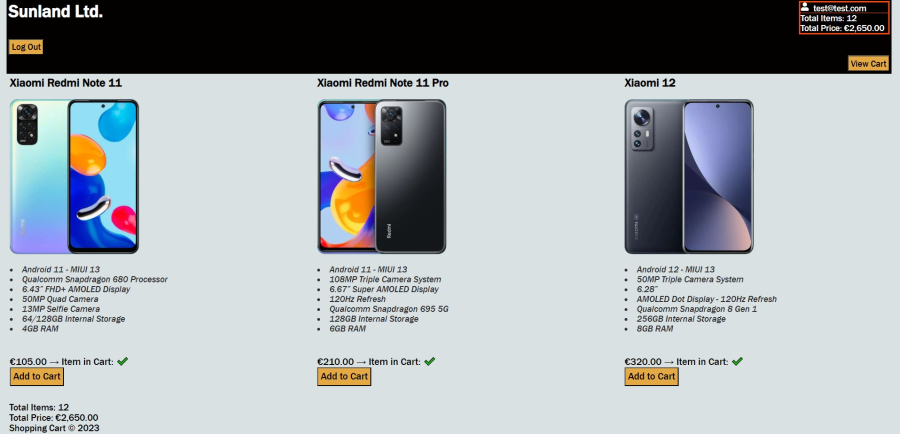

# Shopping-Cart

This simple shopping cart shows how React with Typescript, React hooks, React Context and Styled Components can be used to build an app with instant updates.



### Features

- Login and Register
- Add and remove products from the cart
- Update quantity in the cart
- Send confirmation email with EmailJS
- REST API with Json server for simulating a Backend for fetching Product and User data.

## Build/Run

### Requirements

- Node.js

```javascript

/* Install the needed packages */
npm install

/* Start the json-server */
npx json-server -w data/data.json -p 3501

/* Start the app */
npm run dev

```

#### Optional

- EmailJS account and configuration

Without it will just console log the email message.
